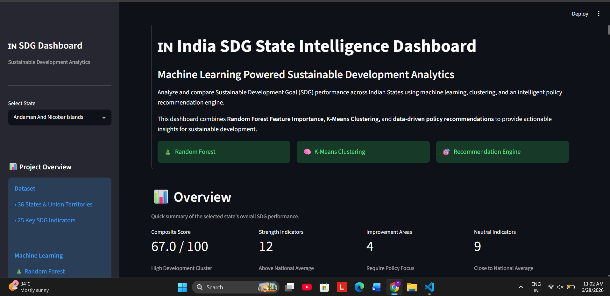
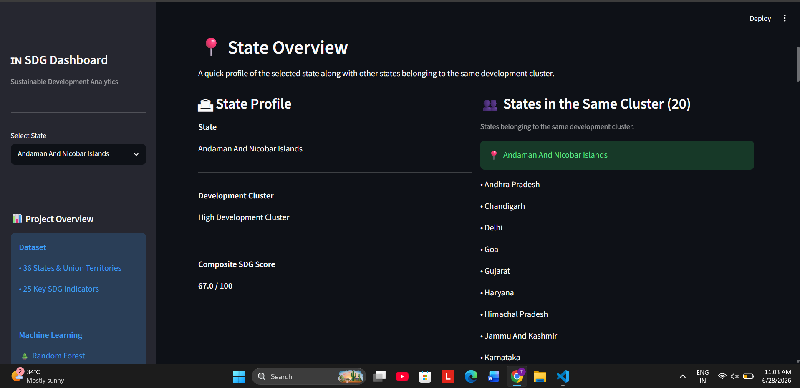
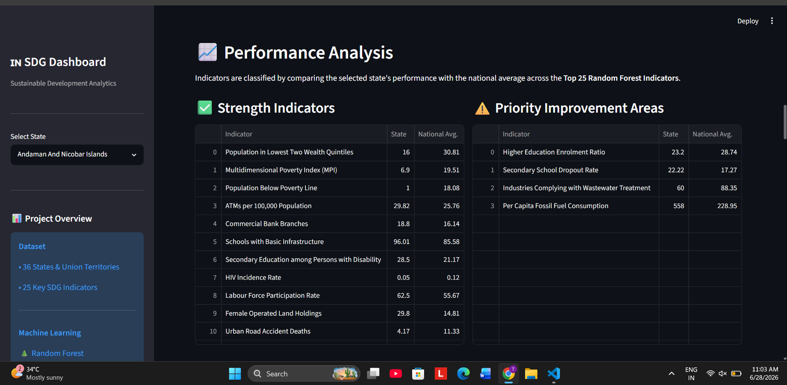
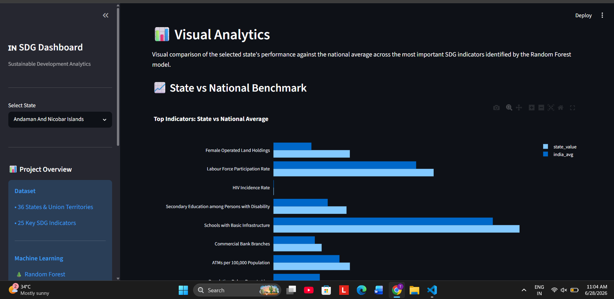
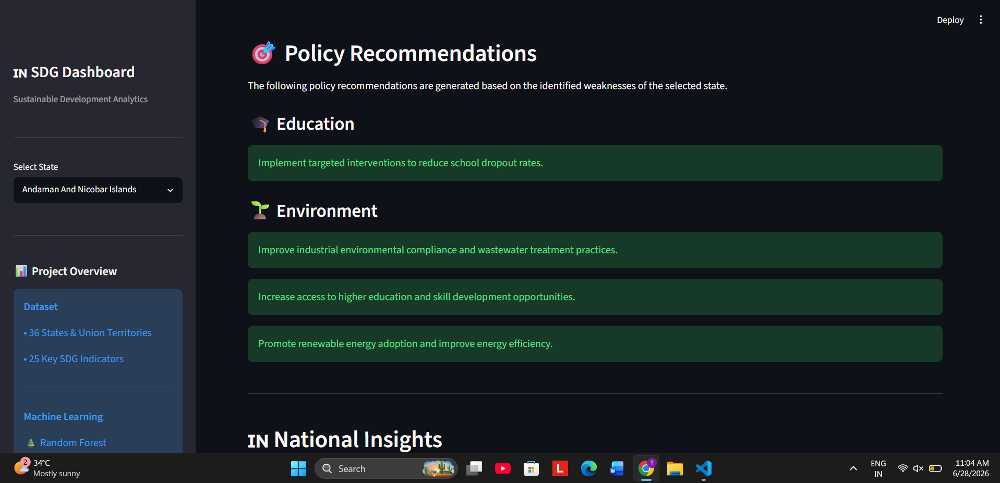
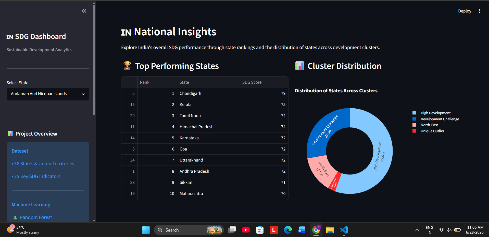

# 🇮🇳 India SDG State Intelligence Dashboard

> **Machine Learning Powered Sustainable Development Analytics for Indian States**

An end-to-end **Data Science** project that analyzes the Sustainable Development Goals (SDGs) performance of Indian States and Union Territories using **Machine Learning**, **Clustering**, and an **Intelligent Policy Recommendation Engine**.

---

# 📌 Project Overview

This project combines **data preprocessing**, **exploratory data analysis**, **machine learning**, and **interactive visualization** to evaluate the SDG performance of Indian States.

The dashboard enables users to:

* Analyze the SDG profile of any Indian State
* Compare state performance with national averages
* Identify strengths and areas for improvement
* Generate intelligent policy recommendations
* Explore national insights using interactive visualizations

---

# 📷 Dashboard Preview

## 🏠 Hero Section



---

## 📍 State Overview



---

## 📈 Performance Analysis



---

## 📊 Visual Analytics



---

## 🎯 Policy Recommendation Engine



---

## 🌍 National Insights



---

# ✨ Key Features

* 📊 Interactive Streamlit Dashboard
* 🌲 Random Forest Feature Importance Analysis
* 🧠 K-Means State Clustering
* 🎯 Intelligent Policy Recommendation Engine
* 📈 Interactive Plotly Visualizations
* 📋 State-wise Performance Analysis
* 🌍 National Insights Dashboard
* 📥 Downloadable State Report

---

# 🤖 Machine Learning Workflow

```
Raw SDG Data
      │
      ▼
Data Cleaning & Preprocessing
      │
      ▼
Exploratory Data Analysis
      │
      ▼
Random Forest Feature Importance
      │
      ▼
K-Means Clustering
      │
      ▼
Policy Recommendation Engine
      │
      ▼
Interactive Streamlit Dashboard
```

---

# 📂 Project Structure

```
SDG_India_Analysis
│
├── app_final.py
├── sdg_engine.py
├── requirements.txt
│
├── data/
├── notebooks/
├── output/
├── docs/
│   └── images/
├── powerbi/
└── sql/
```

---

# 🛠️ Technology Stack

### Programming Language

* Python

### Data Processing

* Pandas
* NumPy

### Machine Learning

* Scikit-learn
* Random Forest Regressor
* K-Means Clustering

### Data Visualization

* Plotly
* Streamlit

### Development Tools

* Jupyter Notebook
* VS Code
* Git
* GitHub

---

# 📊 Machine Learning Techniques Used

### Random Forest Regressor

Used to identify the most influential indicators contributing to the overall SDG Index.

### K-Means Clustering

Grouped Indian States into similar development clusters based on SDG indicators.

### Recommendation Engine

Generated intelligent policy recommendations by comparing state performance with national benchmarks.

---

# 🚀 Installation

Clone the repository

```bash
git clone https://github.com/TrigunJagal66/India-SDG-Intelligence-Dashboard.git
```

Move to the project directory

```bash
cd India-SDG-Intelligence-Dashboard
```

Install dependencies

```bash
pip install -r requirements.txt
```

Run the application

```bash
streamlit run app_final.py
```

---

# 📈 Dashboard Sections

* 🏠 Hero Section
* 📍 State Overview
* 📈 Performance Analysis
* 📊 Visual Analytics
* 🎯 Policy Recommendations
* 🌍 National Insights
* 📥 Download State Report

---

# 🔮 Future Enhancements

* 🗺️ Interactive India Map
* 📈 Time-Series SDG Analysis
* 🤖 AI-powered Insights
* 📊 Advanced Predictive Analytics
* ☁️ Cloud Database Integration

---

# 👨‍💻 Author

**Trigun Jagal**

Computer Science Engineering Student

---

## ⭐ If you found this project useful, consider giving it a Star.
